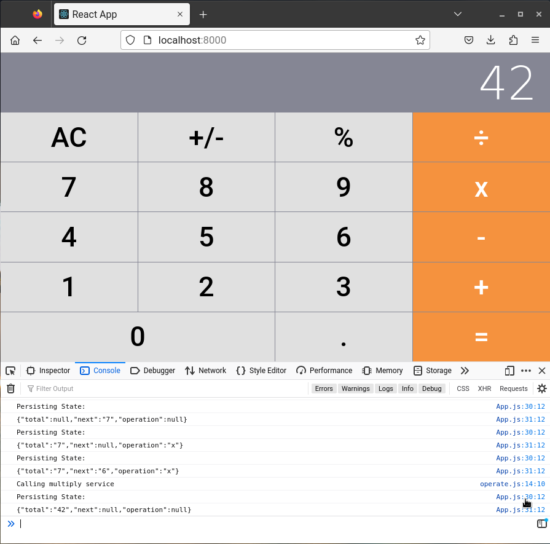
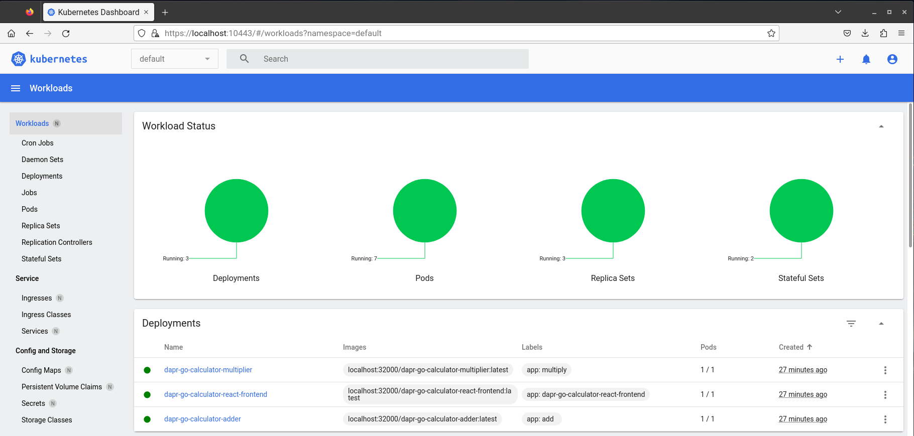

# When upgrading to a new Dapr release:

- microk8s.kubectl delete deployment yamls
- microk8s.ctr delete deployment images
- microk8s.kubectl delete Dapr Redis stores
- `microk8s.helm uninstall dapr -n dapr-system`
- `microk8s.helm repo update` (this upgrades Dapr)
- `microk8s.helm install dapr dapr/dapr --namespace dapr-system`
- microk8s.kubectl apply Dapr Redis stores
- restart Docker
- build / push Docker deployment images
- microk8s.kubectl apply deployment yamls
